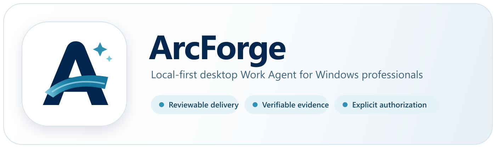
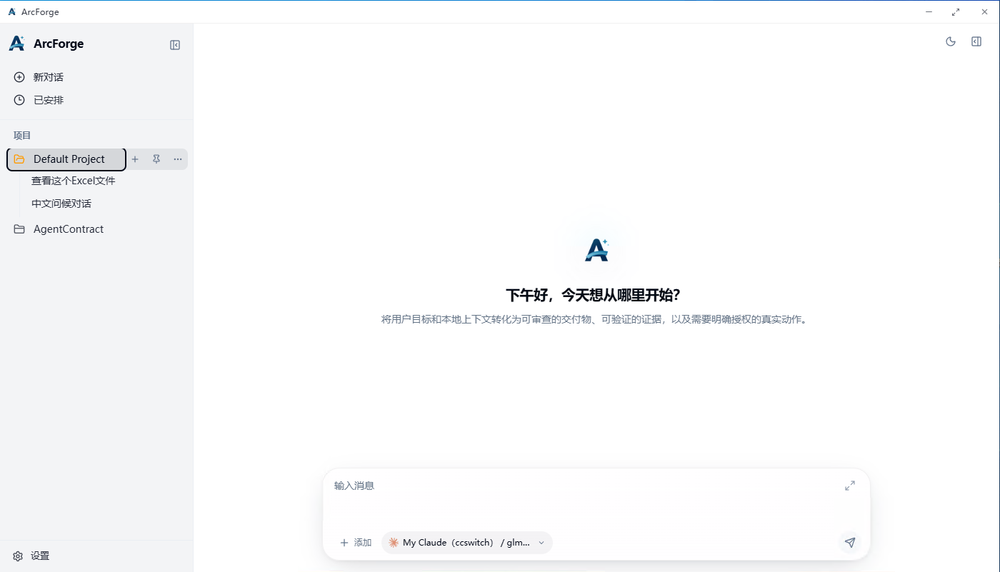

<p align="center">
  
</p>



<p align="center">
  <strong>面向 Windows 专业用户的本地优先桌面 Work Agent</strong>
</p>

<p align="center">
  把目标和本地上下文转化为可审查的交付物、可验证的证据，以及由你明确授权的真实操作。
</p>

<p align="center">
  
  
  
  
  
  <a href="LICENSE"></a>
</p>

<p align="center">
  <a href="#核心能力">核心能力</a> ·
  <a href="#快速开始">快速开始</a> ·
  <a href="#远程访问">远程访问</a> ·
  <a href="#架构概览">架构概览</a> ·
  <a href="#参与开发">参与开发</a>
</p>

---

## 为什么是 ArcForge？

ArcForge 不只是一个聊天窗口。它让 Agent 在你可见、可控的边界内读取上下文、调用工具、生成文件并验证结果，把一次对话推进为真正完成的工作。

| 本地优先                       | 开放扩展                         | 桌面与远程                                 |
| -------------------------- | ---------------------------- | ------------------------------------- |
| 工作区、会话与工具执行以本机为中心，桌面端可独立运行 | 通过 Skills、MCP 和多模型协议组合自己的工作流 | 日常在 Windows 桌面使用，需要时通过 Gateway 从浏览器访问 |

典型闭环：

```text
目标与上下文
    ↓
计划与工具调用
    ↓
可观察的执行过程
    ↓
文件 / Diff / 报告 / 操作结果
    ↓
检查、验证与用户确认
```

## 核心能力

### 多模型对话

- 支持 Anthropic Messages、OpenAI Responses / Chat Completions 与 Gemini Generate Content 协议。
- 可配置自定义 Base URL、请求头和兼容服务，不被单一模型供应商绑定。
- 流式渲染 Markdown、代码、KaTeX 公式、Mermaid 图表和图片。
- 通过对话压缩与持久化，在长任务中保留有效上下文。

### 本地工作台

- 读取、搜索、创建和精确编辑工作区文件。
- 执行 Shell 命令，并托管开发服务器、Watcher 等长驻进程。
- 集成终端、Git 变更查看、SSH / SFTP 与本地服务隧道。
- 支持文档、电子表格和演示文稿相关工作流。

### Agent 协作与扩展

- 可将独立任务交给 Sub-Agent，并使用 Git worktree 隔离并行工作。
- 原生接入 stdio、HTTP 和 SSE 类型的 MCP Server。
- 支持 Skills 的安装、创建、管理和按需加载。
- 内置可扩展工具注册机制，让 Agent 能力保持可组合。

### 记忆与自动化

- 使用本地 Markdown 与 SQLite 全文检索维护跨会话记忆。
- 对长期对话进行分段、摘要和恢复。
- 支持 Prompt、HTTP 与命令类定时任务。

### 远程 Gateway

- Go 编写的轻量 Gateway，内嵌浏览器 WebUI。
- 通过 HTTP、WebSocket v2 与 Protobuf 连接桌面 Agent。
- 支持短时断线恢复、远程终端和文件访问。

## 当前状态

ArcForge 目前是快速迭代中的开发预览版：

- 桌面客户端当前仅面向 **Windows 10/11 x64**。
- 仓库暂不提供官方安装包、在线更新或自动发布渠道。
- 使用者需要从源码构建；对外分发前应接入自己的 Windows 代码签名流程。
- Gateway 是可选组件，桌面客户端本身不依赖服务端。

如果你计划用于重要工作，请先在非关键数据和隔离环境中验证所需模型、工具及权限配置。

## 快速开始

### 环境要求

| 依赖                                       | 用途                        |
| ---------------------------------------- | ------------------------- |
| Windows 10/11 x64 + WebView2             | 运行桌面客户端                   |
| Visual Studio Build Tools（Desktop development with C++） | Windows / MSVC 编译         |
| Rust stable + `x86_64-pc-windows-msvc`   | Tauri 后端                  |
| Node.js 22 + pnpm 10                     | 前端与构建工具                   |
| Python 3.10+                             | 构建 Office Runtime sidecar |

仓库的 Node、pnpm、Go、Protobuf 和 Buf 版本记录在 [`mise.toml`](mise.toml) 中；如果已安装 [mise](https://mise.jdx.dev/)，可运行 `mise install` 准备这些工具。

### 启动桌面开发环境

```powershell
git clone https://github.com/xiaonieli7/ArcForge.git
cd ArcForge

pnpm --dir crates/agent-gui install --frozen-lockfile
rustup target add x86_64-pc-windows-msvc
pnpm --dir crates/agent-gui tauri dev
```

首次启动会创建独立 Python 环境并构建 Office Runtime，因此耗时会比后续启动更长。

### 构建 Windows 安装包

```powershell
pnpm --dir crates/agent-gui tauri build `
  --config src-tauri/tauri.windows.conf.json `
  --target x86_64-pc-windows-msvc
```

生成的 MSI / NSIS 安装包位于 Cargo `target` 目录下的 `release/bundle/`。

如果已安装 GNU Make，也可以使用：

```bash
make dev
make desktop-build-windows
```

## 远程访问

只在需要从浏览器远程访问本地 Agent 时部署 Gateway。

```bash
docker build -t arcforge-gateway:local .

docker run -d \
  --name arcforge-gateway \
  --restart unless-stopped \
  -p 3000:8080 \
  -e ARCFORGE_GATEWAY_TOKEN=replace-with-a-strong-token \
  arcforge-gateway:local
```

启动后，通过 `http://localhost:3000` 打开 WebUI，再在桌面端的 Remote 设置中配置 Gateway 地址和相同 Token。

生产环境建议：

- 使用 HTTPS，并通过反向代理完整转发 WebSocket Upgrade、`Host` 和 `X-Forwarded-Proto` 请求头。
- 使用足够长的随机 Token，不要把 Token 写入镜像或提交到仓库。
- 仅向可信网络开放 Gateway，并按实际需求限制附件大小与访问来源。

## 架构概览

```text
┌─────────────────────────────────────────────────────────────┐
│                    Browser WebUI（可选）                     │
└───────────────────────────┬─────────────────────────────────┘
                            │ HTTP / WebSocket
┌───────────────────────────▼─────────────────────────────────┐
│                       Agent Gateway                         │
│             Go · WebSocket v2 · Protobuf · WebUI            │
└───────────────────────────┬─────────────────────────────────┘
                            │ Remote bridge
┌───────────────────────────▼─────────────────────────────────┐
│                      ArcForge Desktop                       │
│                    Tauri 2 · React · Rust                    │
├────────────┬────────────┬────────────┬────────────┬─────────┤
│ LLM 路由   │ Agent 循环 │ 本地工具   │ Skills/MCP │ 记忆    │
│ 多种协议   │ Sub-Agent  │ FS/Shell   │ 扩展生态   │ 自动化  │
└────────────┴────────────┴────────────┴────────────┴─────────┘
```

### 技术栈

| 组件            | 技术                                       |
| ------------- | ---------------------------------------- |
| 桌面 UI         | Tauri 2、React 19、TypeScript、Vite 8、Tailwind CSS |
| 桌面后端          | Rust、Tokio、SQLite                        |
| 内容渲染          | Streamdown、KaTeX、Mermaid、Monaco Editor   |
| Agent 与模型     | `pi-agent-core`、`pi-ai`、多协议 Provider Adapter |
| Gateway       | Go、HTTP、WebSocket、Protobuf               |
| Gateway WebUI | React、TypeScript、Vite                    |

### 仓库结构

```text
ArcForge/
├── crates/
│   ├── agent-gui/          # Tauri 桌面客户端
│   │   ├── src/            # React 前端与 Agent 运行时
│   │   └── src-tauri/      # Rust 后端、系统能力与内置 Skills
│   └── agent-gateway/      # Go Gateway 与嵌入式 WebUI
├── contracts/              # 机器可读合同与 Schema
├── fixtures/               # 测试与验收夹具
├── scripts/                # 发布和维护脚本
├── tools/                  # 合同校验工具
├── Dockerfile              # Gateway 容器构建
├── Makefile                # 常用开发命令
└── mise.toml               # 共享工具链版本
```

## 参与开发

欢迎通过 Issue 和 Pull Request 改进 ArcForge。提交前请根据改动范围运行对应检查。

### Desktop

```powershell
pnpm --dir crates/agent-gui build
pnpm --dir crates/agent-gui lint
pnpm --dir crates/agent-gui test:frontend
cargo check --manifest-path crates/agent-gui/src-tauri/Cargo.toml --tests
```

### Gateway

```bash
go -C crates/agent-gateway test ./...
pnpm --dir crates/agent-gateway/web build
pnpm --dir crates/agent-gateway/web test
```

### 跨端与合同

```bash
node scripts/check-mirror.mjs
node tools/verify_contract_vectors.mjs
python tools/verify_contract_schema.py
git diff --check
```

完整构建入口可通过 `make help` 查看。

## FAQ

<details>
<summary><strong>必须部署 Gateway 吗？</strong></summary>

不需要。桌面客户端可以独立使用；Gateway 只服务于浏览器远程访问。

</details>

<details>
<summary><strong>支持哪些模型？</strong></summary>

当前支持 Anthropic、OpenAI / Codex 与 Gemini 对应协议，也可通过自定义 Base URL 和请求头连接兼容服务。实际可用模型取决于你的供应商配置。

</details>

<details>
<summary><strong>为什么首次构建比较慢？</strong></summary>

除了前端与 Rust 后端，首次构建还会安装固定版本的 Python 依赖，并打包 Office Runtime sidecar。后续在依赖和源码未变化时会复用已有产物。

</details>

<details>
<summary><strong>可以在 macOS 或 Linux 上运行桌面端吗？</strong></summary>

当前桌面端的构建、Office Runtime 与发布配置只面向 Windows x64。Gateway 服务可以构建为 Linux amd64 / arm64 二进制或 Docker 镜像。

</details>

## License

本项目采用 [MIT License](LICENSE)。
