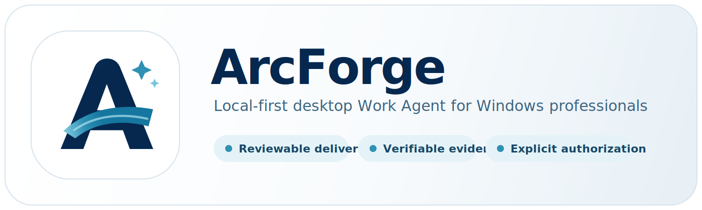

<p align="center">
  
</p>

<h1 align="center">ArcForge</h1>

<p align="center">
  <strong>ArcForge 是一款面向 Windows 专业用户的、本地优先桌面 Work Agent。</strong><br/>
  它把用户目标和本地上下文转化为可审查的交付物、可验证的证据，以及需要明确授权的真实动作。
</p>

<p align="center">
  <a href="README.md">English</a> | 简体中文
</p>

<p align="center">
  
  
  
  
  
  
</p>

<p align="center">
  <a href="#核心能力">核心能力</a> •
  <a href="#下载与部署">下载与部署</a> •
  <a href="#faq">FAQ</a> •
  <a href="docs/">文档</a>
</p>

---

## 为什么是 ArcForge?

ArcForge 的目标不是成为“什么都能做的聊天机器人”，而是成为一款 **本地优先桌面 Work Agent**：把用户目标和本地上下文转化为能够审查、能够验证，并在执行真实动作前要求明确授权的工作成果。

- **真正动手的 Agent** — 不止于对话:读写文件、精确编辑、执行 Bash、托管长驻进程
- **生态完全开放** — MCP 协议桥接任意外部工具,Skills 技能包按需加载
- **本地与远程兼得** — 桌面端独立可用,部署 Gateway 后浏览器随处操控

---

## 核心能力

### 🧠 多模型与对话

- **多模型路由** — Claude(Anthropic)与 Codex(OpenAI)、Gemini 三协议,支持自定义 Base URL 接入第三方兼容服务
- **富文本渲染** — Markdown 流式渲染,内建 KaTeX 公式、Mermaid 图表与 Monaco 代码预览
- **历史压缩** — Segment + Summary Checkpoint 双层持久化,长对话不丢上下文
- **国际化** — 内建 i18n 多语言框架

### 🔧 本地工具执行

- **文件系统全能力** — `Read` / `Write` / `Edit` / `Delete` 精确读写,`Glob` / `Grep` 模式与正则搜索
- **Bash 与长驻进程** — 非交互式命令执行(cwd / timeout),`ManagedProcess` 托管 dev server 等常驻任务
- **Sub-Agent 委派** — 独立子代理并行执行,worktree 隔离,自动合并
- **隧道暴露** — `TunnelManager` 一键将本地服务暴露公网

### 🧩 MCP 与 Skills 生态

- **MCP 协议桥接** — Tauri 端原生桥接任意 stdio / http MCP Server,无限扩展工具能力
- **Skills 技能包** — 渐进式披露、按需加载,支持安装 / 创建 / 打包与 ClawHub 生态

### 💾 记忆与自动化

- **持久化记忆** — Markdown + SQLite FTS 全文检索,跨会话知识管理
- **定时任务** — bash / http / prompt 三种 Cron 任务类型,后台自动执行

### 🌐 远程 Gateway

- **浏览器随处访问** — Go 网关(WebSocket + Protobuf),WebUI 远程操控本地 Agent
- **断线可恢复** — 有界 seq window 补齐短时断线,桌面端持久化兜底

---

## 下载与部署

ArcForge 桌面端当前仅面向 **Windows x64**，由使用者在本地从源码手动构建。本仓库不通过 GitHub Actions 发布桌面安装包，也不提供自动更新源。

### 系统要求

| 平台 | 要求 |
|---|---|
| Windows | Windows 10/11 x64、WebView2、Rust stable/MSVC target、Node.js 22、pnpm 与 Visual Studio Build Tools |

### 手动构建 Windows 桌面端

```powershell
pnpm --dir crates/agent-gui install --frozen-lockfile
rustup target add x86_64-pc-windows-msvc
pnpm --dir crates/agent-gui tauri build --config src-tauri/tauri.windows.conf.json --target x86_64-pc-windows-msvc
```

如果已安装 GNU Make（例如通过 Git Bash），可使用等价命令：

```bash
make desktop-build-windows
# 可选：指定本地构建版本
make desktop-build-windows DESKTOP_VERSION=0.1.0
```

Tauri 会把本地安装包写入 Cargo 的 `target/.../release/bundle/` 目录。它们只是本机构建产物；如需对外分发，请接入你自己的 Windows 签名和发布流程。

### 需要远程访问? 部署 Gateway

桌面端开箱即用,不依赖任何服务端。只有想 **在浏览器里远程操控本地 Agent** 时,才需要部署 Gateway。

**注意：在部署并使用Nginx反向代理后，设置中Remote页面Gateway地址填写Https地址，端口号填写443。**

```bash
# 从当前源码构建 Gateway 镜像
docker build -t arcforge-gateway:local .

# 后台运行(HTTP/WebSocket → 宿主机 3000)
docker run -d \
  --name arcforge-gateway \
  --restart unless-stopped \
  -p 3000:8080 \
  -e LIVEAGENT_GATEWAY_TOKEN=your-token \
  arcforge-gateway:local
```

更新自部署 Gateway 时，先拉取源码变更，再重建本地镜像并使用相同参数重建容器：

```bash
docker build -t arcforge-gateway:local . \
  && docker rm -f arcforge-gateway \
  && docker run -d \
    --name arcforge-gateway \
    --restart unless-stopped \
    -p 3000:8080 \
    -e LIVEAGENT_GATEWAY_TOKEN=your-token \
    arcforge-gateway:local
```

<details>
<summary><b>Nginx 反向代理配置</b> — 自建域名 / TLS 时参考</summary>

> 自 v2 协议起,WebUI、HTTP API 以及浏览器端和桌面端的 WebSocket 链路全部走同一个 HTTP 端口(默认 3000)。
>
> WebSocket 升级发生在多个路径上(`/ws/v2`、`/ws/v2/agent`、`/ws/v2/terminal`,以及 `/t/` 下的隧道),最省事且正确的做法是在整个 vhost 上启用升级:

```nginx
# WebUI SPA/静态资源/API + 全部 WebSocket 链路(浏览器端与桌面端)
location / {
    proxy_pass http://127.0.0.1:3000;
    proxy_http_version 1.1;

    # WebSocket 升级
    proxy_set_header Upgrade $http_upgrade;
    proxy_set_header Connection "upgrade";

    # 必须透传:Gateway 的同源校验会拿浏览器的 Origin 头
    # 与 X-Forwarded-Proto + Host 做比对
    proxy_set_header Host $host;
    proxy_set_header Authorization $http_authorization;
    proxy_set_header X-Forwarded-For $proxy_add_x_forwarded_for;
    proxy_set_header X-Forwarded-Proto $scheme;

    # Gateway 每 15s 主动向每条 WebSocket 连接发 Ping,超时给足冗余即可
    proxy_read_timeout 300s;
    proxy_send_timeout 300s;
    proxy_buffering off;
}
```

> 上游端口与上方 `docker run` 的宿主机映射对应:HTTP/WebSocket 3000(容器内 HTTP 实际监听 `PORT=8080`)。server 块需要 `listen 443 ssl;`,并把 `client_max_body_size` 调大到足够容纳附件上传(如 `100m`)。

</details>


### 从源码构建

下方「开发指南」列出了 Windows 桌面端和 Gateway 的构建命令。


<details>
<summary><b>架构总览</b> — 架构图与技术栈</summary>

```
┌──────────────────────────────────────────────────────────────┐
│                        Browser WebUI                          │
│              React + Vite + WebSocket + Gateway API           │
└────────────────────────────┬─────────────────────────────────┘
                             │ WebSocket / HTTP
┌────────────────────────────▼─────────────────────────────────┐
│                       Agent Gateway                           │
│    Go · WebSocket · HTTP · Session Manager · Event Store     │
│                    (Railway / Docker / 自部署)                 │
└────────────────────────────┬─────────────────────────────────┘
                             │ WebSocket v2 (双向流)
┌────────────────────────────▼─────────────────────────────────┐
│                        Agent GUI                              │
│                   Tauri 2 · React 19 · Rust                  │
├──────────┬───────────┬───────────┬───────────┬───────────────┤
│ 模型协议  │ Agent运行时 │  工具执行   │  Skills   │  Memory/Cron  │
│ pi-ai    │ 多轮循环   │ FS/Bash/  │  渐进披露  │  SQLite+MD    │
│ + Codex  │ + SubAgent │ MCP桥接   │  + Hub    │  FTS索引      │
└──────────┴───────────┴───────────┴───────────┴───────────────┘
```

**技术栈**

| 组件 | 技术 |
|---|---|
| **Agent GUI** · 框架 | Tauri 2 + React 19 + TypeScript 6 |
| **Agent GUI** · 构建 | Vite 8 + pnpm |
| **Agent GUI** · 样式 | Tailwind CSS 4 + Radix UI |
| **Agent GUI** · 渲染 | streamdown + KaTeX + Mermaid + Monaco Editor |
| **Agent GUI** · 后端 | Rust + Tokio + SQLite (rusqlite) + WebSocket (tokio-tungstenite) |
| **Agent GUI** · LLM | @earendil-works/pi-ai · @openai/codex-sdk · claude-agent-sdk |
| **Gateway** · 语言 | Go 1.25 |
| **Gateway** · 协议 | WebSocket + Protobuf + HTTP |
| **Gateway** · Web UI | React + Vite + Tailwind CSS(嵌入式) |
| **Gateway** · 部署 | Docker multi-stage · Railway / 自部署 |

</details>

<details>
<summary><b>开发指南</b> — 常用 Make 命令(完整列表见 <code>make help</code>)</summary>

| 命令 | 说明 |
|---|---|
| `make dev` | 启动 Tauri 开发环境 |
| `make build` | 构建 Windows 桌面应用 |
| `make desktop-build-windows` | 在本地构建 Windows 桌面安装包 |
| `make dev-gateway` | 启动 Gateway 开发服务 |
| `make dev-webui` | 启动 WebUI 开发服务 |
| `make gateway-build` | 构建 Gateway 二进制 |
| `make gateway-docker-build` | 构建 Docker 镜像 |
| `make gateway-docker-smoke` | 构建 + 健康检查 |
| `make build-linux` | Linux amd64 网关 |
| `make build-linux-arm` | Linux arm64 网关 |
| `make proto` | 重新生成 Protobuf 代码 |
| `make clean` | 清理构建产物 |

</details>

<details>
<summary><b>项目结构</b> — 目录树</summary>

```
ArcForge/
├── crates/
│   ├── agent-gui/                # 桌面客户端
│   │   ├── src/                  # React 前端
│   │   │   ├── components/       #   UI 组件
│   │   │   ├── lib/              #   核心逻辑 (chat, tools, skills, memory)
│   │   │   ├── pages/            #   页面 (Chat, Settings)
│   │   │   ├── i18n/             #   国际化
│   │   │   └── prompt/           #   System Prompt 模板
│   │   └── src-tauri/            # Rust 后端 (Tauri)
│   │
│   └── agent-gateway/            # Go 网关服务
│       ├── cmd/gateway/          #   入口
│       ├── internal/             #   核心实现
│       ├── proto/v1/             #   Protobuf 定义
│       └── web/                  #   嵌入式 WebUI
│
├── docs/                         # 项目文档
│   ├── architecture/             #   架构设计
│   ├── features/                 #   功能说明
│   └── operations/               #   运维部署
│
├── scripts/release/              # 本地版本辅助工具
├── .github/workflows/            # 持续集成检查
├── Dockerfile                    # Gateway 容器镜像
├── Makefile                      # 构建命令集
└── Cargo.toml                    # Rust workspace
```

</details>

---

## FAQ

<details>
<summary><b>API Key 会离开本机吗?</b></summary>

不会。秘钥仅保存在桌面端本地,Gateway 只做协议中继 — 不访问文件系统、不存储任何凭据。

</details>

<details>
<summary><b>必须部署 Gateway 吗?</b></summary>

不需要。桌面客户端可独立使用全部本地能力;只有需要从浏览器远程访问本地 Agent 时,才部署 Gateway。

</details>

<details>
<summary><b>支持哪些模型?</b></summary>

内置 Claude(Anthropic) 与 Codex(OpenAI)、Gemini 三协议,并支持自定义 Base URL 接入任何兼容的第三方服务。

</details>

<details>
<summary><b>长对话 / 断线后上下文会丢吗?</b></summary>

不会。桌面端以 Segment + Summary Checkpoint 持久化完整历史;Gateway 通过有界 seq window 补齐短时断线,重连后自动收敛。

</details>

---

## 贡献


**桌面客户端 · `crates/agent-gui`**

1. 类型检查与构建通过:`pnpm build`
2. 代码规范检查通过:`pnpm lint`
3. 前端单元测试通过:`pnpm test:frontend`(改动本地构建/版本脚本时另跑 `pnpm test:release`)
4. Rust 后端检查通过:`cargo check --manifest-path crates/agent-gui/src-tauri/Cargo.toml --tests`(仓库根目录执行)

**Gateway · `crates/agent-gateway`(如有改动)**

1. Go 单元测试通过:`go test ./...`
2. WebUI 构建 / Lint / 测试通过:`pnpm build && pnpm lint && pnpm test`(在 `web/` 目录执行)
3. Proto 变更后重新生成并提交产物:`make proto`

**跨端一致性**

- GUI 与 WebUI 的镜像文件必须逐字节一致:`node scripts/check-mirror.mjs`
- 保持 diff 干净 (无行尾空白):`git diff --check`


---

## License

MIT © StackCairn。ArcForge 改造部分 © nieli。
